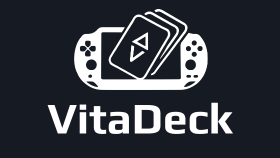

<div align="center">
  

  # VitaDeck

  **A sleek, modern Steam Deck-inspired launcher and collection manager for the PlayStation Vita.**

  [](LICENSE)
  [](https://vitasdk.org/)
  [](https://www.rust-lang.org/)
  [](https://github.com/josephinoo/vitaDeck/releases)

</div>

---

### Overview

**VitaDeck** is a high-performance game launcher and media library manager built natively for the PlayStation Vita in Rust using `vita2d` and `vitasdk`. It delivers a smooth, 60 FPS user experience modeled after the Steam Deck interface, automatically discovering installed titles, downloading high-resolution box art, and allowing custom game organization into playlists.

---

### Features

- **Steam Deck UI Aesthetics**: A polished dark-mode interface featuring dynamic background blurs, status indicators, animated tabs, and micro-interactions.
- **Multi-System Game Scanner**: Automatically scans and catalog games across multiple platforms:
  - **PS Vita** (`ux0:app`)
  - **PSP** (`ux0:pspemu/ISO`)
  - **PSX / PS One**
- **Automatic Cover Art Downloader**: Asynchronously fetches high-definition 3D box art covers from online databases and caches them locally at `ux0:data/VitaDeck/covers/`.
- **Collection & Playlist Manager**: Easily categorize your games into built-in and custom collections such as *Favorites*, *Currently Playing*, and *Completed*.
- **Vector Inter Typography**: Crisp, modern text rendering using embedded Google Inter font via FreeType.
- **Vita3K & Console Ready**: Fully compatible with both native PS Vita hardware and the Vita3K emulator across Vulkan and OpenGL backends.

---

### Controls

| Button | Action |
| :--- | :--- |
| **D-Pad Left / Right** | Browse game library |
| **D-Pad Up / Down** | Navigate collection selection menu |
| **L1 / R1** | Switch system tabs & custom collections |
| **Cross (X)** | Select / Toggle collection membership |
| **Circle (O)** | Cancel / Close menu / Back |
| **Triangle** | Open Collection Manager picker |
| **Square** | Remove game from active collection |
| **Start** | Exit app |

---

### Building from Source

#### Prerequisites
- [VitaSDK](https://vitasdk.org/) installed and set up in PATH.
- Rust `nightly` toolchain with `armv7-sony-vita-newlibeabihf` target.
- `cargo-vita` package built-in.

#### Build VPK
```bash
make vpk
```
Or run cargo directly:
```bash
RUSTFLAGS="-C target-feature=-neon -A internal_features -l freetype -l z -l bz2 -l png" cargo +nightly vita build vpk --release
```

The resulting VPK will be located at:
`target/armv7-sony-vita-newlibeabihf/release/vita_deck.vpk`

---

### License

Distributed under the MIT License. See `LICENSE` for more information.
